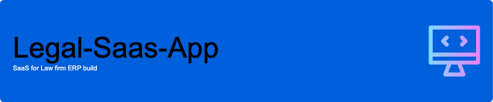
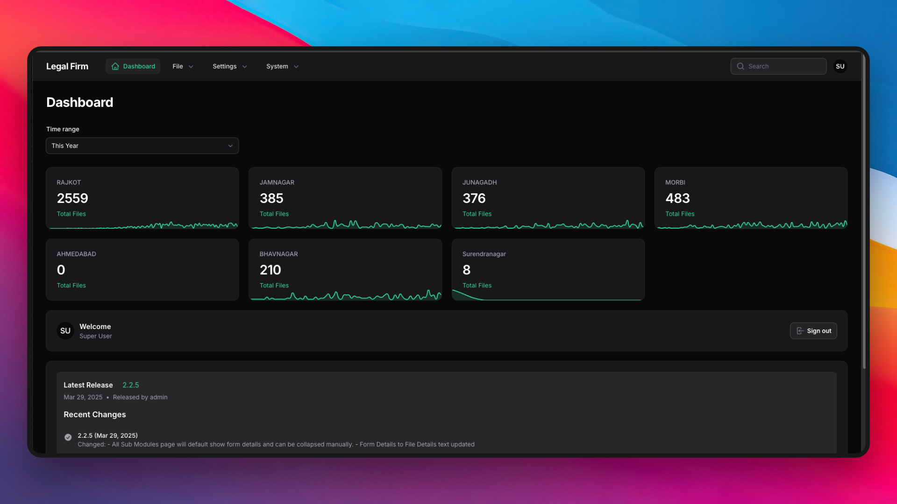

# Legal-Saas-App
SaaS ERP for Law firm  

# ERP Web Application  

This document provides a concise overview of  web application, outlining its modules, their intended use, and the technology stack used.

# Screenshots  

## Overview

The application is designed to manage various processes related to property transactions and related services. It provides a centralized platform for tracking files, documents, and communications.

## Features

*   **File Management:**  Manages all files and associated information.
*   **Document Management:**  Manages all document-related activities.
*   **Search Management:**  Manages various search types and associated information.
*   **Balance Transfer Service:**  Manages balance transfer services, including tracking status and communications.
*   **VR (Valuation Report):** Manages valuation reports, similar to the TSR module.
*   **Companies (Admin/Manager Only):**  Manages company information, including contact details, fees, and document templates.
*   **Branches:** Manages branch information, including contact details.
*   **Users (Admin Only):** Manages user accounts across your organization branches and permissions within the application.

## Banks Integration

*   **Banks Authorities:**  Banks can login to the application and manage their customers and transactions processed through legal procedures.

## Modules

The application comprises the following modules:

*   **File:** The central module for managing all files and associated information.  It provides a high-level view of file status and progress.

*   **TSR (Title Search Report):**  Manages title search reports, including generation, tracking, and query management.

*   **Document:**  Handles all document-related activities, including creation, upload, and tracking of various document types.

*   **VR (Valuation Report):** Manages valuation reports, similar to the TSR module.

*   **Interim Search/Only Search/One Pager:** Manages various search types and associated information.

*   **Extra Work:** Tracks and manages any additional work performed on a file.

*   **BT (Balance Transfer Service):** Manages balance transfer services, including tracking status and communications.

*   **Companies (Admin/Manager Only):**  Manages company information, including contact details, fees, and document templates.

*   **Branches:** Manages branch information, including contact details.

*   **Users (Admin Only):** Manages user accounts and permissions within the application.

## Communication

The application uses the following communication channels:

*   **Email:**  Sends and receives emails from the application.
*   **SMS:**  Sends and receives SMS from the application.
*   **WhatsApp:**  Sends and receives WhatsApp messages from the application.

## Workflow

The application follows a structured workflow, starting with file creation and progressing through various stages as needed.  Each module contributes to the overall file management process.

## Technology Stack

The application is built using the following technologies:

*   **Backend:** PHP, Laravel
*   **Frontend:**  Livewire, FilamentPHP, Tailwind CSS
*   **Database:** PostgreSQL, Redis, Turso 

## Target Users

The application is intended for use by staff, managers, and administrators involved in property transactions and related services.  Different user roles have access to different modules and functionalities.

## Demo and Codebase

For a detailed demonstration of the application and access to the codebase, please contact the creator at shriramsoft@gmial.com or skype: dev.srs.
